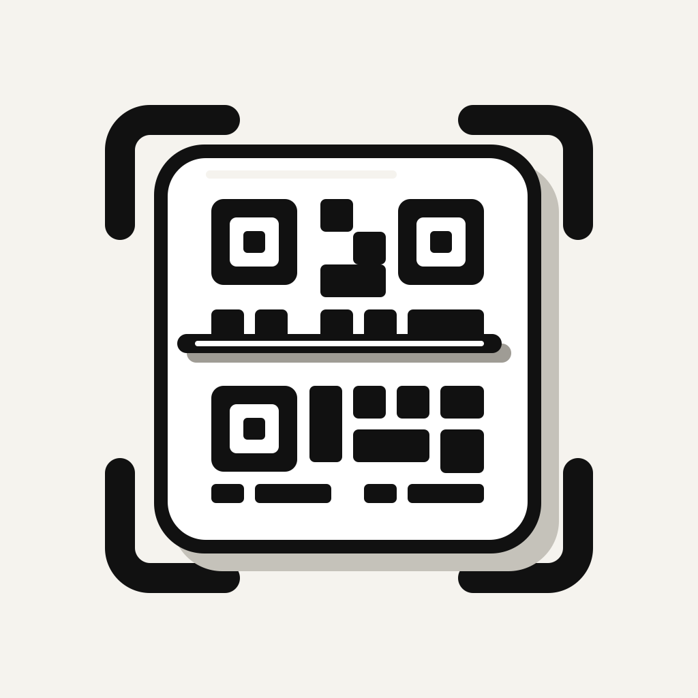

# QrScan

> QrScan is a lightweight native iOS utility for generating and scanning QR codes. It keeps the entire workflow simple and direct, from entering or scanning content to saving and sharing the result.

## Features

- Generate QR codes from text in real time with selectable error-correction levels.
- Scan QR codes using the device camera.
- Detect QR codes in images from the photo library.
- Save generated QR code images to Photos and copy QR code content to the clipboard.
- Keep up to 200 recent scan results in local history.
- Open the scanner quickly from a Home Screen quick action.
- Use the app in English or Simplified Chinese.

## Technology

QrScan is built with SwiftUI and UIKit using Apple's native Core Image, AVFoundation, and Vision frameworks. It has no third-party dependencies.
